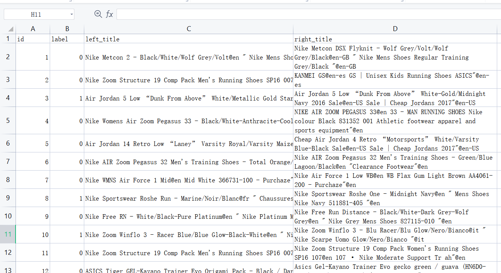
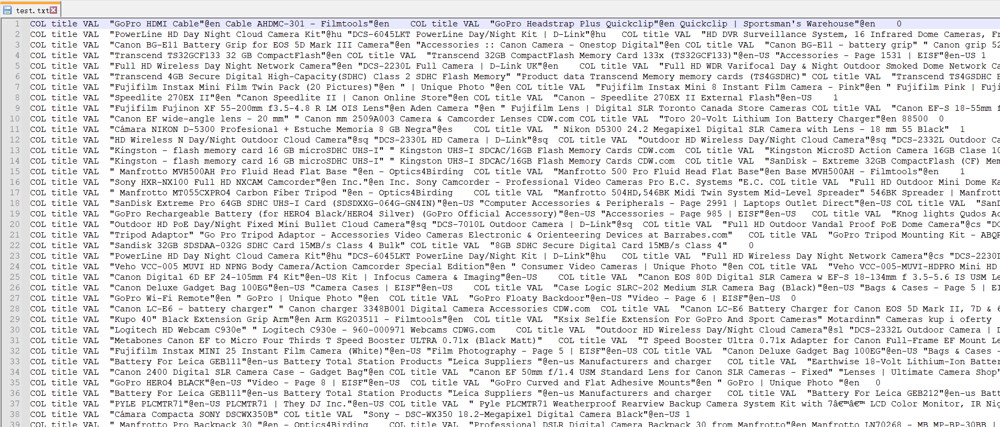

# ER_dataset

两种类型的数据集，一种是结构化的数据，另外一种是序列化的数据。

结构化的数据供基于深度学习的模型（例如Deepmatcher）使用

序列化的数据供基于预训练的模型（例如Ditto）使用。

另外，重点提供了WDC数据集的结构化表示，方便研究者在WDC数据集上将自己的模型与其他baseline方法做比较。

## Structured

## Serialized

